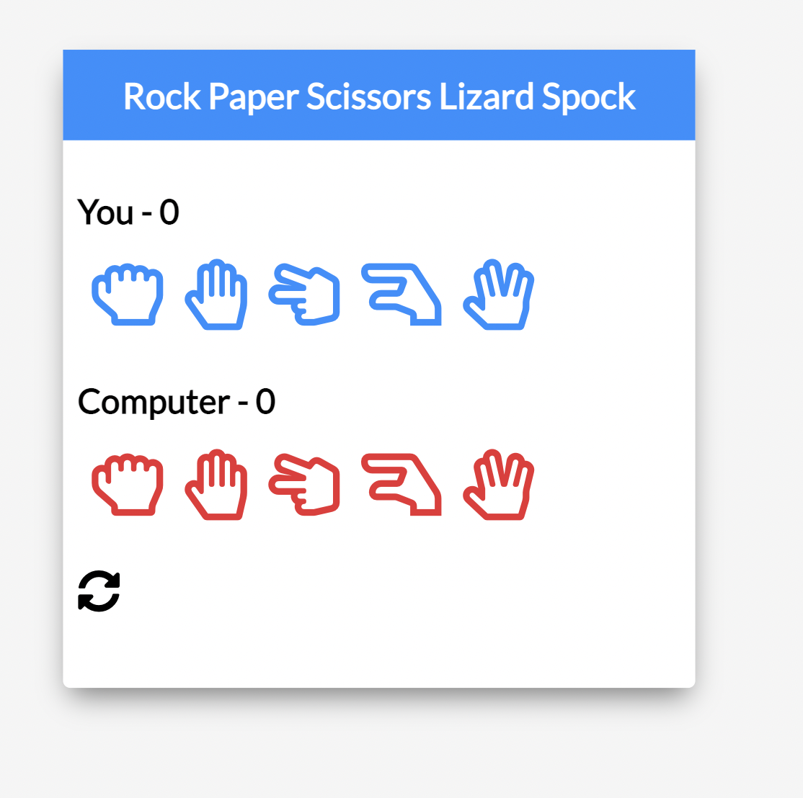

<!-- PROJECT LOGO -->
 

  

<h3 align="center">RockPaperScissorsLizardSpock</h3>

  

    project_description
     
    <a href="https://github.com/darynatkm/RockPaperScissorsLizardSpock"><strong>Explore the docs »</strong></a>
     
     
    <a href="https://github.com/darynatkm/RockPaperScissorsLizardSpock">View Demo</a>
    ·
    <a href="https://github.com/darynatkm/RockPaperScissorsLizardSpock/issues">Report Bug</a>
    ·
    <a href="https://github.com/darynatkm/RockPaperScissorsLizardSpock/issues">Request Feature</a>
  

<!-- ABOUT THE PROJECT -->
## About The Project

The app is created to enable Rock Pape rScissors Lizard Spock game that is well-known thanks to the TV series 'The Big Bang Theory'. The rules are quite simple: 
    Scissors cuts Paper
    Paper covers Rock
    Rock crushes Lizard
    Lizard poisons Spock
    Spock smashes Scissors
    Scissors decapitates Lizard
    Lizard eats Paper
    Paper disproves Spock
    Spock vaporizes Rock
    (and as it always has) Rock crushes Scissors

(<a href="#readme-top">back to top</a>)

### Built With

Vanilla JS, HTML, CSS

<!-- CONTACT -->
## Contact

Daryna Tokmachova  - darynatokmachova@gmail.com

Project Link: [https://github.com/darynatkm/RockPaperScissorsLizardSpock](https://github.com/darynatkm/RockPaperScissorsLizardSpock)

